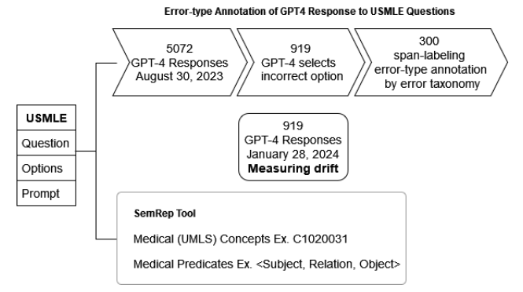

This contains the "GPT-4 USMLE Error Dataset" (G4UE) that is submitted to the SIGIR 2024 Resource Track. The paper is titled "Beyond Accuracy: Investigating Error Types in GPT-4's Responses to USMLE Questions".

The resources are present under the "data" directory.

The semrep annotations consisting of UMLS concepts and semantic predications are present under "semrep" directory.

The codebase for setting up the Potato annotation platform to replicate our span-labeling annotation setup in present under "prolific-potato-annotation" directory

## Resources Overview

